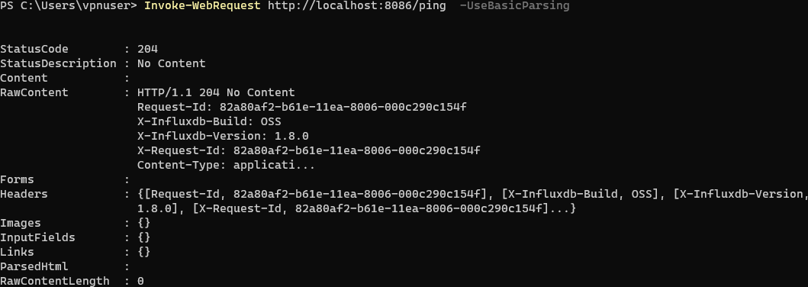
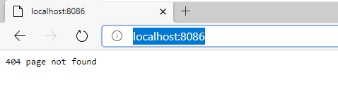

# Installation and configuration InfluxDB on Microsoft Windows

Step 0: Run as administrator
Use `PowerShell` for command line.

Step 1: Download InfluxDB version 1.8.0
https://dl.influxdata.com/influxdb/releases/influxdb-1.8.0_windows_amd64.zip

```
Invoke-WebRequest -Uri https://dl.influxdata.com/influxdb/releases/influxdb-1.8.0_windows_amd64.zip -OutFile $Env:Temp\influxdb-1.8.0_windows_amd64.zip
```
or use manual download from https://portal.influxdata.com/downloads/

Step 2: Create directories for binary

```
New-Item -ItemType Directory -Path $Env:ProgramFiles\InfluxData
New-Item -ItemType Directory -Path $Env:ProgramFiles\InfluxData\InfluxDB
```

Step 3: Expand archive
Expand archive content without top directory.
```
 Expand-Archive -Force $Env:Temp\influxdb-1.8.0_windows_amd64.zip $Env:ProgramFiles\InfluxData\InfluxDB
 Move-Item $Env:ProgramFiles\InfluxData\InfluxDB\influxdb-1.8.0-1\** $Env:ProgramFiles\InfluxData\InfluxDB\
 Remove-Item $Env:ProgramFiles\InfluxData\InfluxDB\influxdb-1.8.0-1\
```

**NOTE:** Not all following steps require admin rights.

Step 4: Create directories for configuration and data files
```
New-Item -ItemType Directory -Path $Env:ProgramData\InfluxData\InfluxDB
New-Item -ItemType Directory -Path $Env:ProgramData\InfluxData\InfluxDB\meta
New-Item -ItemType Directory -Path $Env:ProgramData\InfluxData\InfluxDB\data
New-Item -ItemType Directory -Path $Env:ProgramData\InfluxData\InfluxDB\wal
```

Step 5: Copy configuration file
```
Copy-Item $Env:ProgramFiles\InfluxData\InfluxDB\influxdb.conf $Env:ProgramData\InfluxData\InfluxDB\
```

Step 6: Edit
```
notepad $Env:ProgramData\InfluxData\InfluxDB\influxdb.conf
```

content:
```
[meta]
  # Where the metadata/raft database is stored
  dir = "C:\\ProgramData\\InfluxData\\InfluxDB\\meta"


[data]
  # The directory where the TSM storage engine stores TSM files.
  dir = "C:\\ProgramData\\InfluxData\\InfluxDB\\data"

  # The directory where the TSM storage engine stores WAL files.
  wal-dir = "C:\\ProgramData\\InfluxData\\InfluxDB\\wal"

[http]
  # Determines whether HTTP endpoint is enabled.
  enabled = true

  # The bind address used by the HTTP service.
  bind-address = ":8086"

```

## Create firewall rule
```
New-NetFirewallRule -DisplayName "InfluxDB daemon" -Direction Inbound -Program $Env:ProgramFiles\InfluxData\InfluxDB\influxd.exe -RemoteAddress LocalSubnet -Action Allow
```

## Test run
```
&$Env:ProgramFiles\InfluxData\InfluxDB\influxd.exe run -config "$Env:ProgramData\InfluxData\InfluxDB\influxdb.conf"
```

**Quick test**
```
Invoke-WebRequest http://localhost:8086/ping  -UseBasicParsing
```


Or use internet browser and try to browse http://localhost:8086



And finally use `influx` command line interface
```
start $Env:ProgramFiles\InfluxData\InfluxDB\influx.exe
```

## Run InfluxDB as a Windows service

You are going to run it as a service, using the very popular NSSM tool on Windows.

Step 1: Download NSSM 2.24
```
Invoke-WebRequest -Uri https://nssm.cc/release/nssm-2.24.zip -OutFile $Env:Temp\nssm-2.24.zip
```
or use manual download from https://portal.influxdata.com/downloads/

Step 2: Create directories for binary

```
New-Item -ItemType Directory -Path $Env:ProgramFiles\NSSM
```

Step 3: Expand archive
Expand archive content without top directory.
```
 Expand-Archive -Force $Env:Temp\nssm-2.24.zip $Env:Temp
 Copy-Item $Env:Temp\nssm-2.24\win64\nssm.exe  $Env:ProgramFiles\NSSM\
 ```

Step 4: Setup service
```
&$Env:ProgramFiles\NSSM\nssm.exe install InfluxDB "$Env:ProgramFiles\InfluxData\InfluxDB\influxd.exe" run -config "$Env:ProgramData\InfluxData\InfluxDB\influxdb.conf"
&$Env:ProgramFiles\NSSM\nssm.exe set InfluxDB Start SERVICE_DELAYED_AUTO_START

```

## Clean temporary files
```
Remove-Item $Env:Temp\influxdb-1.8.0_windows_amd64.zip
Remove-Item $Env:Temp\nssm-2.24.zip
Remove-Item $Env:Temp\nssm-2.24
```

## Links
 * [How To Install InfluxDB on Windows in 2019](https://devconnected.com/how-to-install-influxdb-on-windows-in-2019/)
 * [Installing InfluxDB on Windows](http://richardn.ca/2019/01/04/installing-influxdb-on-windows/)
